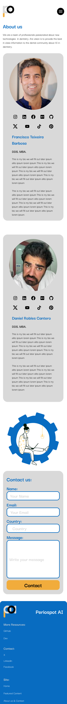
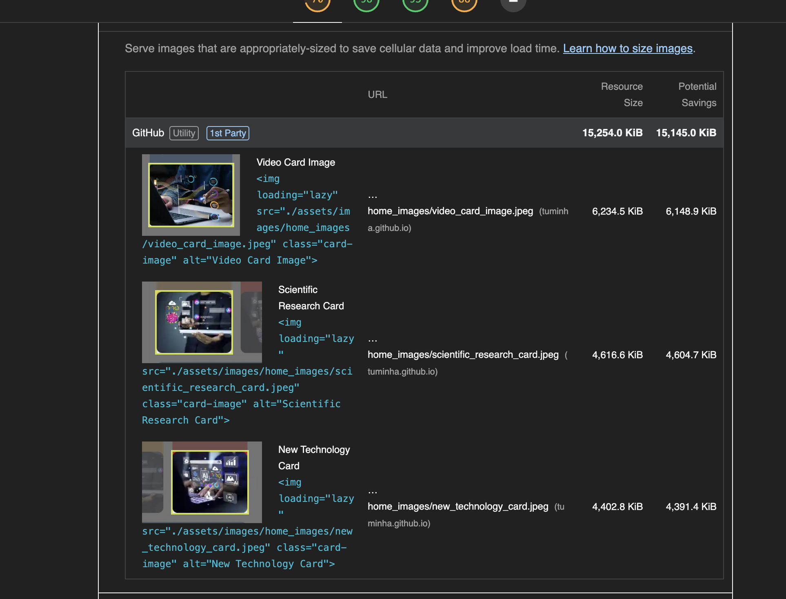

# Periospot AI

Developer: Francisco Teixeira Barbosa

[Link to the live webpage](https://tuminha.github.io/periospot.ai/)

## Table of Contents

## [Project Goals](#1-project-goals)

   1.1 [User Goals](#user-goals)

   1.2 [Site Owner Goals](#site-owner-goals)

## [User Experience](#2-user-experience)

   2.1 [Target Audience](#target-audience)

   2.2 [User Requirements and Expectations](#user-requirements-and-expectations)

   2.3 [User Stories](#user-stories)

## [Design](#3-design)

   3.1 [Design Choices](#design-choices)

   3.2 [Colour](#colour)

   3.3 [Fonts](#fonts)

   3.4 [Structure](#structure)

   3.5 [Wireframes](#wireframes)

   3.6 [Prototype](#prototype)

## [Technologies Used](#4-technologies-used)

   4.1 [Languages](#languages)

   4.2 [Frameworks & Tools](#frameworks--tools)

## [Features](#5-features)

## [Testing](#6-testing)

   6.1 [HTML Validation](#html-validation)

   6.2 [CSS Validation](#css-validation)

   6.3 [Accessibility](#accessibility)

   6.4 [Performance](#performance)

   6.5 [Device testing](#device-testing)

   6.6 [Browser compatibility](#browser-compatibility)

   6.7 [Testing user stories](#testing-user-stories)

## [Bugs](#7-bugs)

## [Deployment](#8-deployment)

## [Credits](#9-credits)

## [Acknowledgements](#10-acknowledgements)

## 1. Project Goals

### 1.1 User Goals

The primary objectives of Periospot.ai for its users, specifically dentists, are as follows:

- To provide a platform where users can find the best curated content related to AI in dentistry.
- To keep users updated with the latest research and videos on the topic.
- To offer curated content about the latest AI technologies applied to dentistry.

### 1.2 Site Owner Goals

The primary objectives of Periospot.ai for site owners are as follows:

- To establish a subscriber list of dentists and dental professionals who have a keen interest in AI technology.
- To utilize this subscriber list as a platform for distributing newsletters and updates about the latest advancements in AI technology in dentistry.
- To generate leads through the shared content and subsequently offer courses to these prospects, thereby fostering a community of professionals who are well-versed in the application of AI in dentistry.

## 2. User Experience

### 2.1 Target Audience

The target audience for Periospot.ai is dentists and dental professionals who are interested in AI technology and its application in dentistry.

### 2.2 User Requirements and Expectations

Periospot.ai is designed with the user in mind. The navigation is intuitive and straightforward, allowing users to easily find the information they need. The site's aesthetic is modern and professional, reflecting the cutting-edge nature of AI technology in dentistry. Real-time information is provided to keep users up-to-date with the latest developments in the field.

Interaction with the site managers is facilitated through a direct and user-friendly interface, ensuring that any queries or issues can be addressed promptly. Accessibility is a key priority, and the site is designed to be easily navigable for all users, regardless of their level of technical proficiency.

The content is organized into clear, distinct sections, making it easy for users to locate specific topics or areas of interest. Each section is filled with carefully curated content, providing users with a wealth of knowledge at their fingertips.

### 2.3 User Stories

#### First time user

As a first-time user, I have several expectations and questions:

- I want to understand the basics of AI technology. What does it entail? How does it differ from other technologies?
- I am interested in the potential of AI technology. What can it achieve, particularly in the field of dentistry?
- I want to know what type of content I can find on this platform. What topics does it cover? How is the content curated?
- I am curious about the clinical relevance of the content provided by Periospot.ai. How can it enhance my practice or research in dentistry?
- I want to know what to expect from the platform in the future. Will there be updates or new features? How will the platform evolve to keep up with advancements in AI technology?

#### Returning user

As a returning user, I have several specific expectations:

- I wish to stay informed about the latest news and developments in the field of AI, with a particular focus on its applications in dentistry.
- I am interested in discovering opportunities for further learning and professional development, such as courses, training programs, and events related to AI in dentistry.
- I am keen to explore any AI technologies or services that I can directly subscribe to or purchase through the platform.
- I am eager to understand how these technologies can be integrated into my practice or research to enhance efficiency and outcomes.

#### Site owner goals

As the proprietor of the site, my primary objective is to cultivate a robust list of subscribers. This list will serve as a direct line of communication, enabling the distribution of regular newsletters. These newsletters will highlight new services, products, educational courses, training programs, and other relevant offerings. Furthermore, as the site owner, I am committed to delivering top-tier, globally relevant content to dental professionals. This commitment is driven by a desire to contribute to the ongoing education and professional development of this community.

## 3. Design

The wireframes for the website can be viewed on Figma at the following link: [Periospot.ai Wireframes](https://www.figma.com/file/emTdZt9i4LSO60OQ3TyYZr/Periospot.ai?type=design&node-id=0%3A1&mode=design&t=v1InG5IObQFhxC4S-1)

You can view the high fidelity prototype of the website on Figma at the following link: [Periospot.ai Prototype](https://www.figma.com/file/emTdZt9i4LSO60OQ3TyYZr/Periospot.ai?type=design&node-id=7%3A506&mode=design&t=v1InG5IObQFhxC4S-1)

### 3.1 Design Philosophy
The design of Periospot AI’s web platform is conceptualized to navigate the intersection of technology and dentistry. It is crafted to be as innovative and forward-thinking as the field it represents, aiming to offer insightful and actionable content through an interface that feels both intuitive and enlightening.

### 3.2 Colour Scheme
The colour palette for Periospot AI is carefully chosen to reflect the vibrancy and diversity of AI technology in dentistry. We have selected a combination of vivid and soft tones to create a balance between excitement and sophistication. This includes:

- Dark-grey (#0D0D0D) for a strong, authoritative background in sections like the subscription area.
- Vivid-yellow (#F1AC3C) to symbolize innovation, used primarily for the Research section and interactive buttons.
- Vivid-red (#E01D1F) and Vivid-blue (#086CC1) to denote urgency and trust, used for New Technology and AI Videos sections respectively.
- Soft-grey (#ECECEC) and Dark-blue (#023462) as complementary colours to add depth and contrast.
These colours are not only aesthetically pleasing but also pass accessibility standards, ensuring readability and inclusivity.

### 3.3 Typography
Our typography choices are intended to merge clarity with personality. We use the 'Darker Grotesque' font family, a modern and versatile typeface that scales beautifully across devices. The varying weights from light to bold are utilized to create a hierarchy of information and draw attention to different sections of the content.

- Headings are bold and assertive, with 'Darker Grotesque Extra Bold' for primary headings to anchor each section with confidence.
- The body text is rendered in 'Darker Grotesque Regular', ensuring legibility and ease of reading for longer paragraphs.

### Layout and Structure
Periospot AI’s layout is strategically structured to facilitate the user journey from discovery through to engagement:

- The homepage serves as a gateway, featuring a dynamic hero section that encapsulates the essence of AI in dentistry, leading to curated featured content that showcases the latest studies and innovations.
- The Featured Content page is a grid of cards, each a portal to detailed articles and resources, signifying the breadth of information available.
- The About Us & Contact page introduces the team behind Periospot AI, building trust and opening channels for communication through an intuitive contact form.
- The navigation is straightforward, with a top navigation bar that is consistent across pages. Each section is designed to ensure users can find information with ease and are encouraged to explore deeper into the content.

The mobile-responsive design ensures that the experience is seamless on any device, with cards and content blocks realigning themselves to fit narrower screens without compromising on usability or visual appeal.

### Wireframes

#### Home Page

#### Contact Page

#### Mobile Featured Articles

#### Mobile Home Page

#### Resources Page

### Prototype

This are the high fidelity prototype of the website in desktop and mobile version.

#### Desktop Version

This is the high fidelity prototype of the home page in desktop version.

This is the high fidelity prototype of the home page in desktop version with active elements.

This is the high fidelity prototype of the featured content page in desktop version.

This is the high fidelity prototype of the featured content page in desktop version with active elements.

This is the high fidelity prototype of the About Us & Contact page in desktop version.

#### Mobile Version

This is the high fidelity prototype of the home page in mobile version.

This is the high fidelity prototype of the featured content page in mobile version.

This is the high fidelity prototype of the About Us & Contact page in mobile version.

## 4. Technologies Used

### Languages

- HTML
- CSS
- JavaScript just in preparation to connect with Mailelite

### Frameworks & Tools

- [Gitpod](https://www.gitpod.io/): The IDE (Integrated Development Environment) used for developing this project.
- [GitHub](https://github.com/): The platform used for version control and project management.
- [Figma](https://www.figma.com/): The platform used for creating wireframes and high fidelity prototypes.
- [Google Fonts](https://fonts.google.com/): The source of the fonts used in the project.
- [Adobe Colors](https://color.adobe.com/create/color-wheel): The platform used for creating the color palette.
- [Adobe Stock](https://stock.adobe.com/): The source of licensed photos used in the project.
- [MailerLite](https://www.mailerlite.com/): Used for email marketing services like sending newsletters, as referenced in the index.html and mailerlite.js files.
- [Tree](https://linux.die.net/man/1/tree): A recursive directory listing command that produces a depth-indented listing of files, which is helpful to see the overall structure of the project directories and files.
- [Code Institute PP1 Enhanced](https://chat.openai.com/g/g-X76f8eiVs-code-institute-pp1-enhanced): GPT as a Mentor for HTML/CSS Project Compliance. This role is tailored to support students undertaking the Diploma in Full Stack Software Development. The GPT mentor is equipped to guide students through all stages of their HTML/CSS projects, ensuring adherence to the program's assessment criteria.

### Libraries

- [Google's Material Icons](https://fonts.google.com/icons): Used for the hamburger menu icon in the index.html file.

### Methodologies

- Mobile-First Design: The CSS file, style.css, is structured to follow a mobile-first approach to styling, where styles are first defined for mobile, and then adapted for larger screens.
- BEM (Block Element Modifier): The naming convention in the CSS file, style.css, follows the BEM methodology for class names, which helps to keep the styles scalable and maintainable.

## 5. Features

Periospot AI's website is a comprehensive platform spread across three main pages, each offering unique functionalities that engage users with interactive and informative content.

### Home Page

**Intuitive Navigation:** A responsive navigation bar allows for seamless transitions between different sections of the site. On smaller screens, it collapses into a hamburger menu, maintaining easy access without compromising user experience.
**Hero Section:** The landing area introduces the core theme of the site - Learning AI in Dentistry - with a call-to-action button that invites users to start their journey.
**Curated Featured Content:** This section showcases highlighted areas such as Scientific Research, New AI Technology, and Video Resources, each represented by engaging cards with succinct descriptions and inviting visuals.

### Featured Content Page

**Articles and Resources:** A grid layout presents articles and resources, allowing users to explore various topics. The design ensures that each card is equal in height, aligning content neatly regardless of the varying text lengths.
**Dynamic Layout:** The page dynamically adjusts the layout for different screen sizes, ensuring a consistent user experience across devices.
**Interactive Buttons:** Each card features a button that links to the full article or resource, encouraging users to delve deeper into the content.

### About Us & Contact Page

**Professional Profiles:** Sections for team introductions provide personal and professional insights, fostering trust and connection with users.
**Contact Us Form:** An interactive form collects user inquiries, with validation to ensure data integrity. It's paired with a Google Maps integration to display the location and encourage physical visits.
**Responsive Design:** The entire page is responsive, resizing and reordering content to maintain readability and ease of use on any device.
### Newsletter Subscription

**Engagement Tool:** A newsletter subscription form across different pages offers a point of engagement and a method for users to stay updated, enhancing the community around Periospot AI.
Each feature is meticulously designed to address specific user stories, ensuring that the site not only delivers content effectively but also creates an immersive experience that resonates with the audience's expectations and needs.

## 6. Testing

### HTML Validation

The HTML code was validated using the [W3C Markup Validation Service](https://validator.w3.org/).

The HTML files were validated and passed without any errors. Here are the validation results for each file:

**index.html:** 

**featured.html:** 

**contact.html:** 

### CSS Validation

The CSS file was validated using the [W3C CSS Validation Service](https://jigsaw.w3.org/css-validator/).

**style.css:** 

### Accessibility Validation

The accessibility of the website was validated using the [WAVE WebAIM web accessibility evaluation tool](https://wave.webaim.org/). All pages were tested and passed with 0 errors. Here are the validation results for each page:

**Home Page:** 

**Featured Content Page:** 

**About Us & Contact Page:** 

### Performance

Chapter 1: The Wake-Up Call

The initial Lighthouse report delivered a stark reality: the Periospot AI homepage was underperforming, with a score of 70 in Performance. The primary culprit? Oversized images that were bulky, slowing down page loads and affecting user experience negatively.

Chapter 2: The Optimization Quest

The journey began with resizing images, converting them to more efficient formats like WebP using the cwebp tool. This crucial step reduced bytes and improved loading times dramatically, exemplified by the significant decrease in the potential savings after the conversion.

Chapter 3: The Rise in Performance

The featured content page's performance soared to a 93 score after the image optimizations. Larger Contentful Paint and Cumulative Layout Shift numbers indicated that the website was becoming more responsive and visually stable.

Chapter 4: Tackling the Core Issues

Next, the focus turned to render-blocking resources and inefficient cache policies. Refinements were made to the site's cache-loading strategies, along with adjustments to how resources were loaded and scripts were deferred, leading to an even smoother user experience.

Chapter 5: The Final Frontier

The contact page faced its own set of challenges, from lazy-loaded images to cache policy inefficiencies. But with diligent application of best practices, the page performance experienced an uptick, moving closer to perfection.

Epilogue: A Speedier Web Experience

As the curtain falls on this optimization odyssey, the Periospot AI website emerges leaner and faster. The final Lighthouse reports glow green with scores in the high 90s, a testament to the meticulous efforts in performance enhancement.

Also this is the performance per page with the screenshots of the Lighthouse report:

**Home Page:** 

**Featured Content Page:** 

**About Us & Contact Page:** 

### Device Testing

### Testing User Stories

#### As a first-time user, I want to understand the purpose of the website

Feature | Action | Expected Result | Actual Result
--- | --- | --- | ---
Home Page | Navigate to the Home Page | Understand the purpose of the website through the hero section and introductory text | Works as expected
About Us & Contact Page | Navigate to the About Us & Contact Page | Learn more about the team behind the website and their mission | Works as expected

#### As a first-time user, I want to explore the featured content

Feature | Action | Expected Result | Actual Result
--- | --- | --- | ---
Featured Content Page | Navigate to the Featured Content Page | See a grid layout of articles and resources on various topics | Works as expected

#### As a returning user, I want to subscribe to the newsletter

Feature | Action | Expected Result | Actual Result
--- | --- | --- | ---
Newsletter Subscription | Locate the newsletter subscription form on different pages and submit it | Stay updated with the latest content and news from the website | Works as expected

#### As a returning user, I want to contact the team

Feature | Action | Expected Result | Actual Result
--- | --- | --- | ---
Contact Us Form | Navigate to the About Us & Contact Page, locate the contact form, fill it out and submit it | Send inquiries or messages to the team | Works as expected

#### As the site owner, I want to engage users with interactive and informative content

Feature | Action | Expected Result | Actual Result
--- | --- | --- | ---
Home Page | Check the Home Page | See a dynamic hero section and curated featured content that showcases the latest studies and innovations | Works as expected
Featured Content Page | Check the Featured Content Page | See a grid of cards, each a portal to detailed articles and resources | Works as expected
About Us & Contact Page | Check the About Us & Contact Page | See professional profiles of the team and an interactive contact form | Works as expected

# Bugs and Future Implementations

Bug / Future Implementation | Description
--- | ---
Missing server.js file | Initially, we were trying to run a server.js file that didn't exist in our project directory. This was causing Node.js to throw a MODULE_NOT_FOUND error. We identified this issue and advised to create a server.js file.
MailerLite integration | We were trying to integrate MailerLite into our project for handling newsletter subscriptions. We provided a basic example of how we could set up a server-side script to handle POST requests from our client-side script and interact with the MailerLite API.
Server not starting | After setting up the server.js file and .env file, we tried to start our server with the node server.js command, but didn't see the expected output ("Server running on port 3000"). We suggested several things to check, including the location of our .env file, the format of our environment variables, and the installation of necessary Node.js packages.
MailerLite implementation | Despite our efforts, we were not able to solve the issue with starting the server. This could be due to a variety of factors, such as a problem with our Node.js installation, a misconfiguration in our system, or an issue with the MailerLite API key or group ID. Without more information, it's difficult to determine the exact cause of the problem. We decided to fake the success in subscription for now and leave the full MailerLite implementation to the next stage of our project.

## 8. Deployment

The website was deployed using GitHub Pages by following these steps:

- In the GitHub repository navigate to the Settings tab
- On the left hand menu select Pages
- For the source select Branch: master
- After the webpage refreshes automatically you will see a ribbon on the top saying: "Your site is published at https://tuminha.github.io/periospot.ai/"

You can fork the repository by following these steps:

- Go to the GitHub repository
- Click on Fork button in upper right hand corner

You can clone the repository by following these steps:

- Go to the GitHub repository
- Locate the Code button above the list of files and click it
- Select if you prefer to clone using HTTPS, SSH, or Github CLI and click the copy button to copy the URL to your clipboard
- Open Git Bash
- Change the current working directory to the one where you want the cloned directory
- Type git clone and paste the URL from the clipboard ($ git clone https://github.com/YOUR-USERNAME/YOUR-REPOSITORY)
- Press Enter to create your local clone.

Live site is at https://tuminha.github.io/periospot.ai/index.html

Repo is at https://github.com/Tuminha/periospot.ai

## 9. Credits

### Content

Most of the illustrations from the hero image were retrieved from the community in Figma. Also, the other images are from Adobe Stock Photo, and some of the illustrations are created by the creator and the developer. The following resources were also used:

- Udemy course on Figma management: [Figma UI UX Design Advanced Tutorial](https://www.udemy.com/course/figma-ui-ux-design-advanced-tutorial/learn/lecture/38955510#overview)
- Lessons from [FreeCodeCamp](https://www.freecodecamp.com)
- CSS tricks from CodeCamp
- Learnings from the [Twitter Developer Community](https://twitter.com/developer)
- Design and color palette inspiration from [Baunhaus](https://www.behance.net/gallery/177076455/BAUHAUS-App-Branding?log_shim_removal=1)
- Inspiration from [Dribbble](https://dribbble.com/)
- Website design inspiration from [Awwwards](https://www.awwwards.com/websites/)

### Acknowledgements

- A big thank you to my mentor Mo Shami for his guidance and support throughout this project. He gave me some last minute insights that literally took me out of my negative spiral and helped me to finish the project.

- tahnk you to my family, my five kids and my wife for their support and patience during this journey.

- Also the amazing tema on Code Institute Student care for their support and help during this journey.